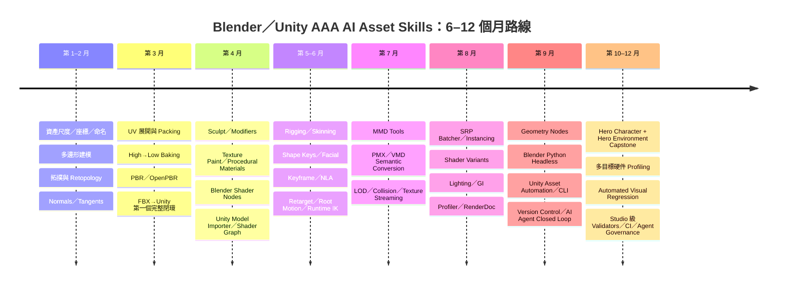
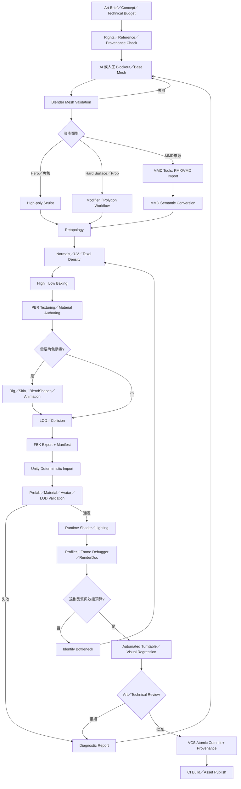

# Blender／MMD／Unity AAA 級 AI 資產製作：五十項核心技能研究報告

## 執行摘要

以 **2026 年 8 月 26 日** 為基準，本報告採用 **Blender 5.2 LTS** 與 **Unity 6.3 LTS** 作為生產基線。Blender 官方顯示 5.2 LTS 於 2026 年 7 月 14 日發布、維護至 2028 年 7 月，而截至 2026 年 8 月 25 日已更新至 5.2.1；Unity 官方則把 6.3 列為目前最新 LTS，支援至 2027 年 12 月。citeturn28search0turn28search1turn26search0

本研究的核心結論是：**要讓 AI agent 實際交付 AAA 級資產，真正需要的不是「50 個軟件操作」，而是一條可驗證、可重現、可回退的完整資產鏈。** 高品質建模只是起點；拓撲、切線空間、UV、烘焙、PBR、綁骨、動畫、LOD、shader variant、GPU 成本、Unity import 規則、版本控制及 deterministic automation 都會直接決定資產能否進入遊戲。Unity 官方特別指出，非 deterministic importer 會造成不同機器／Cache 得出不同結果、視覺差異甚至 build failure，因此對 AI agent 而言「自動產生」必須和「自動驗證」視為同一項能力。citeturn31search0turn31search3turn31search4

對「AAA realistic、硬件未指定」這個前提，不應先訂死「角色 10 萬面」「每件材質 4K」之類固定預算；正確做法是建立 **screen-space、frame-time、GPU memory、draw-call、skinning、overdraw 與 texture residency** 指標，再在實際目標硬件 profile。Unity 的 Rendering Profiler 正是用來量度 CPU/GPU rendering 資源消耗，而官方 profiling 指引亦強調應圍繞目標 frame time 做量測。citeturn25search11turn27search7

在 Blender 端，5.2 的 Principled BSDF 已以 **OpenPBR Surface** 為基礎；OpenPBR 本身是 Academy Software Foundation 管理的開放表面著色標準，目標之一正是提高不同 DCC／renderer 間的材質一致性。因此 AI agent 應學的是 roughness、metalness、IOR、coat、subsurface、transmission 等物理語義，而不是死記某一版節點位置。citeturn23search2turn21search1turn21search4

MMD 應被視為一個**來源格式／動畫生態的轉換層**，而不是 AAA runtime 格式。Blender Extensions 的 MMD Tools 可處理 MMD 模型編輯、模型匯入／匯出、剛體等工作；目前維護中的 MMD-Blender fork 在 2026 年仍持續更新，例如 v4.5.13 是 6 月 28 日的 Blender Extensions 維護版，而較早的 v4.5.5 已修正 Blender 5.0+ 的 Principled BSDF 問題。這同時說明 MMD pipeline 必須 **pin 插件版本並做 round-trip regression test**，不能假定 PMX/VMD → Blender → Unity 是完全無損。citeturn30search0turn29search0

AI automation 方面也有一個重要的 2026 年變化：Unity 已把 in-Editor AI Assistant 套件內的 MCP server 標為 deprecated，官方方向是改用 **Unity CLI 的 `unity mcp`、`unity command`、`unity eval`**；CLI 可直接驅動 Editor，並支援 structured JSON/TSV、exit code、非互動安裝及 CI service authentication。對 AI agent 架構而言，這比把核心生產 pipeline 綁死於某個第三方 MCP 插件更適合作為長期基礎。citeturn26search2turn27search3

**本報告的優先級含義：** 排名越前，不一定越「炫技」，而是越可能成為後續多項技能的共同前置條件。第一至第十項刻意形成一個最短的 **Blender → baked PBR asset → FBX → Unity** 閉環；角色綁骨、MMD、程序化及 AI automation 則在基本資產閉環穩定後加入。

## 研究基準與取捨原則

**能力等級定義**

| 等級 | 本報告的含義 |
|---|---|
| 入門（Novice） | 能依 SOP 完成單一已知工作，不適合自行制定 AAA 規格 |
| 中階（Intermediate） | 能穩定生產及發現常見錯誤 |
| 進階（Advanced） | 能診斷跨 Blender／Unity 問題並依效能需求取捨 |
| 專家（Expert） | 能制定 studio 級規格、工具、自動驗證與例外處理 |

**去重原則。** 我沒有把同一工作流中的每個按鈕拆成獨立「技能」。例如 IK、FK、constraints 合併到「骨架與控制 Rig」；ZRemesher、Quad Remesher、Blender Remesh/Poly Build 都歸入「重拓撲」；xNormal、Marmoset 或其他 baker 不各自算一項；Perforce、Git LFS、Unity Version Control 則歸入「大型二進制版本控制」。這符合「兩項重疊時只保留最佳代表」的要求。

**插件選擇亦採同一原則。** Rigify 是 Blender 官方文件涵蓋的自動綁骨 add-on，採 building-block／meta-rig 方法，因此它作為第 21 項 Rigging 的工具，而不另外膨脹成一個技能。citeturn32search0turn32search12 MMD 則保留 MMD Tools，因為它直接覆蓋 PMX／MMD workflow，沒有把 CATS、PMX Editor 等相鄰工具再列為獨立核心技能。

**格式方面，FBX 被列為主要 Unity round-trip 技能，而非把 `.blend` 直接 import 當生產標準。** Unity 官方指出直接使用 DCC proprietary format 需要相應 DCC 安裝，而 FBX 是 Unity 主要支援的 model interchange 格式；Unity 同時能從 FBX 匯入 animation 與 blend shapes。對 CI／build farm／AI worker 而言，顯式 export FBX 的依賴較容易控制。citeturn25search0turn25search12 Blender 的 glTF／USD 仍有價值，但屬於不同 interchange/use-case，故不另佔核心五十項。Blender 自身亦完整支援 glTF animation、shape keys 及 skinning。citeturn24search28

**渲染策略則採「Blender reference render + Unity runtime render」雙重真值。** Cycles 是 Blender 的 production physically based path tracer，而 EEVEE 是著重速度與互動的 realtime PBR renderer；利用兩者作離線 reference／快速 lookdev，可以較容易分辨「材質本身錯了」還是「Unity runtime approximation／燈光設定造成差異」。citeturn23search15turn24search18

## 優先技能總表

| 優先 | 技能與精簡定義 | 領域 | AI agent 對 AAA 生產的主要貢獻 | 主要限制／風險 | 推薦工具／插件 | AAA 所需程度 |
|---:|---|---|---|---|---|---|
| **1** | **尺度、座標、命名與 Transform 衛生**：統一單位、forward/up axis、origin、pivot、scale、命名及 hierarchy。 | Pipeline／建模 | Agent 在建模開始前建立 machine-readable asset contract；可自動拒絕 negative scale、錯誤 pivot、命名衝突及錯誤骨架 root，避免問題一路污染碰撞、動畫及 Unity import。 | 最容易被忽視；錯誤通常到 animation／physics 才暴露。不同軟件 axis convention 亦容易造成 90° rotation 或 scale mismatch。 | Blender Transform／Python；Unity Model Importer。citeturn25search18turn24search23 | 中階 |
| **2** | **多邊形／硬表面建模**：以 vertex、edge、face、extrude、inset、bevel 等建立可控 game mesh。 | Modeling | Agent 能由 concept/reference 建 props、武器、建築、機械與 modular kit，並為後續 high/low-poly、UV、collision 提供乾淨幾何。 | 「看起來對」不代表 topology／silhouette／shading 合格；生成式 mesh 常有內面、重疊、非流形及密度失控。 | Blender Mesh Edit、Mesh Analysis。Blender 把 mesh 結構明確分為 vertices、edges、faces、normals、topology 等。citeturn23search16 | 進階 |
| **3** | **動畫友善拓撲與 Edge Flow**：按形體、變形及 shading 安排 edge loops、poles 與面密度。 | Topology | AI 可用 topology rules 檢測關節、眼口、肩胯及硬表面轉角，決定哪些邊真正影響 silhouette／deformation。 | 單純追求全四邊形並不等於好拓撲；game mesh 最終會三角化，真正關鍵是 deformation、normal 與穩定 triangulation。 | Blender Loop Cut、Knife、Mesh topology tools。citeturn23search18turn23search20 | 專家 |
| **4** | **重拓撲 Retopology**：把 sculpt／scan／生成式 dense mesh 轉成可動畫、可 UV、可即時渲染的低模。 | Retopology | 是 AI 3D generation 進 AAA pipeline 的核心「清洗」技能；Agent 可先生成高模，再以 target silhouette、deformation zones 和 budget 做 retopo。 | 全自動 remesh 難保證 facial loops、肩膀、手指等 deformation topology；仍需 QA。 | Blender Poly Build、Remesh；可選 Quad Remesher／外部 retopo，但不另列技能。官方明確把 remeshing 定義為重新產生較少／較多面或較佳 topology 的 mesh。citeturn23search0turn23search10 | 進階 |
| **5** | **法線、平滑與切線空間**：管理 face/vertex normals、sharp edges、smoothing 與 tangent basis。 | Mesh shading | Agent 能自動找出 hard edge／UV seam 不一致、normal map seam、反面及 custom normal 異常，直接改善低模「像高模」的可信度。 | FBX export、重新 triangulate 或 Unity import 設定不一致，都可能令 baked normal map 改觀；不能只看 Blender viewport。 | Blender Normals／Auto Smooth 類工具；Unity Model Importer。Blender 文件亦指出 custom split normals 與 sharp edge 需要被保留。citeturn23search12turn25search18 | 進階 |
| **6** | **UV 接縫與展開**：把 3D surface 映射至 2D texture domain。 | UV | Agent 能按可見度、材質分界及變形決定 seams，減少 stretching，提供 baking、painting 與 lightmapping 基礎。 | 全自動 seam placement 容易把 seam 放在 hero view；錯誤展開會令 texel density、normal bake 及手繪細節崩壞。 | Blender UV Editor／Unwrap。官方 workflow 把 UV maps、transfer、UDIM 等列為完整 UV 管線。citeturn23search8 | 中階 |
| **7** | **UV Packing、Texel Density 與 Padding**：在有限貼圖空間分配一致像素密度與安全邊距。 | UV／Optimization | Agent 可根據屏幕重要性自動分配 island scale、padding 及 mirrored reuse，平衡品質與 VRAM。 | 過緊 packing 會在 mipmap／compression 下 bleeding；完全一致 texel density 亦不一定適合 hero face 等視覺重點。 | Blender UV Pack／UV editing。citeturn23search5 | 進階 |
| **8** | **高低模 Baking**：把高模細節轉成 normal、AO、curvature、ID 等低模可用資料。 | Baking | 是 high-poly → runtime asset 的核心壓縮步驟；Agent 可批次 bake、檢查 cage、ray miss、skew、seam 及 map range。 | Cage、triangulation、tangent basis 或 UV padding 有任何錯誤，都會出現難修的 bake artifact。 | Blender Cycles Bake；可選 Substance/Marmoset baker，但不另列。Blender 官方 Bake 支援從材質／texture／lighting 產生不同 passes。citeturn23search6 | 進階 |
| **9** | **PBR／OpenPBR 材質原理**：以能量守恆、microfacet、roughness、metal/dielectric、IOR 等描述物質。 | Materials | AI 不再只是「調到好看」，而是從材質類別推斷 physically plausible parameter range，提升 Blender ↔ Unity 一致性。 | PBR 不等於 photorealistic；錯誤 lighting/reference 一樣能得到錯誤材質。不同 renderer 亦不可能完全 pixel-identical。 | Blender Principled BSDF／OpenPBR；Unity Lit/HDRP Lit。Blender 5.2 Principled 以 OpenPBR Surface 為基礎。citeturn23search2turn21search4 | 進階 |
| **10** | **FBX Export／Import Round-trip**：控制 units、axes、triangulation、normals、bones、clips、blendshapes 在 DCC 與 Unity 間傳遞。 | Interchange | Agent 建立第一個完整閉環：Blender asset → deterministic export → Unity import → screenshot／stats validation → 回修。 | FBX 能傳遞資料但不會完整傳遞任意 Blender node shader；constraint／procedural modifier 通常要 bake/apply 或重新表達。 | Blender FBX、Unity FBX/Model Importer。Unity 主要支援 FBX model workflow，亦可從 FBX 匯入 animation/blend shapes。citeturn25search12turn24search32 | 進階 |
| **11** | **高模雕刻與有機造型**：利用 sculpt/multires 建角色、皮膚、布摺、磨損與細節來源。 | Modeling／Sculpt | Agent 可從 blockout 逐級提升形體，再把細節 bake 到 runtime mesh；適合角色、怪物及破損表面。 | AI 容易「微細節很多、主形體很差」；過早雕刻 pores 不能彌補 anatomy/proportion 錯誤。 | Blender Sculpt、Multiresolution。citeturn24search9 | 進階 |
| **12** | **非破壞式 Modifier 建模**：用 Mirror、Bevel、Boolean、Subdivision 等維持可編輯 construction history。 | Modeling | Agent 可參數式修改尺寸、細分及變體，而非每次破壞性重建；尤其適合 procedural iteration。 | Modifier stack 順序高度敏感；export 前何時 apply 必須有明確規則。 | Blender Modifiers；官方定義 modifier 為非破壞式 geometry operation。citeturn24search21turn24search1 | 進階 |
| **13** | **UDIM、多 UV Set 與 Lightmap UV 規劃**：管理 hero asset 高解析分塊及不同用途 UV channel。 | UV | Agent 可把材質 UV、lightmap UV、detail/mask UV 分離；hero character 可用 UDIM 做離線／source authoring，再按 Unity runtime 策略轉換。 | UDIM 不應自動等同 runtime 最佳方案；貼圖數、streaming、shader sampling 成本要按平台決定。 | Blender UDIM／multiple UV maps；Unity secondary UV。citeturn23search1turn25search15 | 進階 |
| **14** | **Blender Shader Nodes／Principled Authoring**：建立節點化、可參數化 look-development graph。 | Shading | Agent 可程式化建立、比較及校驗材質節點，先在 Blender 做高品質 reference，再轉換成 Unity 可用 maps／parameters。 | 複雜 Blender procedural graph 不會自動等價於 Unity Shader Graph；需要 bake 或重寫。 | Blender Shader Editor、Principled BSDF。citeturn23search2turn28search9 | 進階 |
| **15** | **3D Texture Painting 與 Masking**：在模型表面繪製 base color、roughness、mask、細節。 | Texturing | Agent 可從 bake maps／semantic masks 產生 wear、dust、edge variation，再由 human/vision QA 修正高可見區。 | 純生成 texture 常出現尺度不一致、左右不合理污漬及 semantic hallucination；亦要避免 baked lighting 混入 base color。 | Blender Texture Paint；亦可配 Substance 3D Painter。 | 進階 |
| **16** | **程序化材質與可重用 Material Graph**：以 noise、mask、geometry/texture features 生成一致材質族。 | Texturing／Materials | Agent 可由「乾淨→磨損→濕→泥污」自動產生 variation，而不用儲存大量獨立 texture。 | 過度 procedural 會增加 authoring/render complexity；Unity runtime 版本通常需 bake 或簡化。 | Blender Shader Nodes／Geometry Nodes；MaterialX/OpenPBR 思維。citeturn21search1turn24search13 | 進階 |
| **17** | **Unity Model Importer 與 Prefab Import 驗證**：設定 mesh、normals、materials、animation、Avatar、secondary UV 等。 | Unity integration | Agent 可在 import 後自動驗證 scale、mesh stats、blendshape count、Avatar validity、material mapping、LOD 和 secondary UV。Unity ModelImporter API 本身可由 editor script 修改 importer。citeturn25search15turn25search18 | 直接靠人工 Inspector 設定不易重現；preset／script 更改又可能造成舊資產 reimport 差異。 | Unity ModelImporter、Presets、Prefab。 | 進階 |
| **18** | **Unity Shader Graph 與必要 HLSL**：建立 runtime surface、vertex、fullscreen 或自訂 shader。 | Real-time shader | Agent 將 Blender lookdev 轉成真正遊戲 shader，實作 mask packing、detail normal、dissolve、vertex deformation、角色特效等。 | Shader Graph 很容易長成不可維護「spaghetti graph」；超出標準功能時仍需 HLSL、GPU architecture 與 profiling 知識。 | Unity Shader Graph、HLSL、HDRP/URP shader framework。Unity 6.3 亦持續擴充 Shader Graph authoring。citeturn27search0 | **專家** |
| **19** | **高階角色材質：SSS、皮膚、眼、頭髮、布料、透明、anisotropy**。 | Character shading | Agent 能把通用 PBR 擴展至 AAA 角色最敏感的視覺區域；例如 skin SSS、wet eye、hair anisotropic response。 | 這些材質極依賴 renderer、lighting 及幾何；透明頭髮尤其會帶來 overdraw/sorting 成本。 | Blender Principled/Cycles；Unity HDRP Lit／Hair 等相應 shader。Disney 的 production shading 研究也是現代 physically based lookdev 的重要基礎。citeturn21search0 | 專家 |
| **20** | **色彩管理、Scene-linear 與 HDR**：正確處理 texture encoding、linear lighting、display transform 及 exposure。 | Rendering／Pipeline | Agent 能避免「Blender 很好、Unity 灰／過曝／太黑」一類 gamma/colorspace 錯誤，亦能可靠比較 reference images。 | 未校準顯示器、錯誤 sRGB/data texture 標籤會讓所有材質判斷失準。 | Blender Color Management；Unity Color Space／HDR settings。Blender 官方指出 rendering/compositing 最適合在 scene-linear 色彩空間進行。citeturn24search2turn24search10 | 進階 |
| **21** | **骨架層級、Constraints、IK/FK Rigging**：建立可動畫且可輸出的控制骨架；Rigify 作代表性自動化工具。 | Rigging／Add-on | Agent 建 deformation skeleton、control rig、IK/FK switching 與 export skeleton；Rigify 可快速生成複雜 controls。 | Control rig 不應直接等同 runtime skeleton；需避免多餘 bones、constraint 依賴及 export hierarchy 污染。 | Blender Armature、Constraints、Rigify。Rigify 是 building-block 式 automatic rigging。citeturn24search36turn32search0turn32search20 | 專家 |
| **22** | **Skinning 與 Weight Painting**：把 mesh deformation 權重分配至 bones。 | Rigging | Agent 可做 initial auto-weight，再用 deformation test poses 找出 elbow/knee/shoulder/crotch artifact，自動迭代權重。 | 「權重總和正確」不代表 deformation 美觀；骨骼 influence 數亦會影響 runtime。Unity importer 可限制每 vertex skin weights。citeturn32search1turn32search13turn25search24 | 專家 |
| **23** | **Corrective Deformation／Pose-space 修形**：針對特定 pose 補償 skinning 無法表現的肌肉／體積。 | Character deformation | Agent 可偵測 extreme pose 與 reference silhouette 差異，建立 driver/shape-key correction。 | Corrective 太多會令 rig 複雜、export/runtime 成本上升；必須挑高價值 pose。 | Blender Shape Keys、Drivers。Blender 官方亦示範以 shape key 改善 rig deformation。citeturn32search30 | 專家 |
| **24** | **臉部 BlendShape／Shape Key 系統**：以 morph targets 表達表情、phoneme、corrective face shape。 | Facial animation | Agent 建立 expression vocabulary、口型及組合規則，再輸出 Unity BlendShapes；可進一步用 FACS 思維規範語義。 | 大量 blendshape 增加記憶體與 deformation cost；shape 必須保持 vertex topology 完全一致。 | Blender Shape Keys、Unity SkinnedMeshRenderer blend shapes。Shape Keys 亦稱 morph targets／blend shapes，而 Unity 可從 FBX 匯入它們。citeturn32search6turn25search12 | 專家 |
| **25** | **Keyframe、Graph Editor 與 Animation Curve 清理**：控制 timing、spacing、interpolation、overshoot。 | Animation | Agent 可分析 curve continuity、速度峰值、foot contact，清除 noisy keys 並維持動作意圖。 | 「減 key」不能破壞 silhouette、contact 或 facial nuance；純數值平滑可令動作失去生命力。 | Blender Dope Sheet、Graph Editor、Actions。Blender Action 是 animation data 的容器。citeturn24search4turn24search16 | 進階 |
| **26** | **NLA／動畫分層與 Clip 管理**：把 Actions 排列、混合及重用成較高層次 sequence。 | Animation | Agent 能建立 locomotion clips、additive layers、gesture 組合及批次 export boundaries。 | NLA blending、root motion 與 Unity clips 切割規則不一致時易產生 offset。 | Blender NLA。官方描述 NLA 為高層級處理 Actions 而非逐 keyframe 工作。citeturn24search0turn24search12 | 進階 |
| **27** | **Humanoid Retarget、Avatar 與 Root Motion**：把動作映射至不同角色比例，並明確管理角色位移。 | Animation／Unity | Agent 可以建立 reusable motion library，一次處理大量 NPC／角色，並驗證 Avatar map、T-pose、root orientation。 | 極端比例、extra bones、肩膀／手腕 orientation 會令 retarget 失真。 | Unity Humanoid Avatar、Animator；Blender retarget helpers。Unity 的 Humanoid／Generic importer 有不同語義。citeturn25search3turn25search24 | 進階 |
| **28** | **Runtime IK／Animation Rigging**：在遊戲中以 constraints 修正腳、手、瞄準、道具互動。 | Runtime animation | Agent 可在 Unity 自動生成 foot IK、weapon aim、hand placement、look-at 等 rig layer，補足 baked animation。 | IK 不應用來掩蓋壞 animation；過多 constraints 亦有 CPU 成本及 order dependency。 | Unity Animation Rigging 6.6。官方 package 用 constraints 加入 procedural motion，並建立在 Animator 之上。citeturn32search3turn32search11 | 專家 |
| **29** | **Mocap 清理、重定向與 Contact 修正**：處理 motion capture noise、漂移、foot sliding、穿插。 | Animation | Agent 對 mocap 做自動 contact detection、curve cleanup、retarget，再交由藝術 QA。 | 過度 smoothing 會移除慣性與細微表演；手指、臉與道具 interaction 通常仍需人工高質修正。 | Blender Graph/NLA、Unity Humanoid/Animation Rigging。citeturn24search20turn32search3 | 專家 |
| **30** | **布料、頭髮 Secondary Motion 與遊戲物理代理**：把高品質模擬轉成可控 runtime approximation。 | Simulation | Agent 可用 Blender 做高質 reference/cache，然後建立 bones、cards、collision proxies 或 Unity runtime constraints。 | 離線 cloth/hair simulation 不能直接假定可即時執行；collision、determinism 及平台成本差異很大。 | Blender Physics；Unity Animation Rigging／項目選定的 cloth solution。 | 專家 |
| **31** | **MMD PMX／PMD／VMD／VPD 匯入、編輯及匯出**。 | MMD | Agent 可把既有 MMD 模型／motion 讀入 Blender，進行 mesh、bone、material、motion 清理，再進標準 Unity pipeline。 | 插件版本與 Blender 版本有相容性風險；需要固定版本並留 regression samples。 | **MMD Tools**。Blender Extensions 明確列有 MMD 模型編輯、import/export、rigid-body 等功能。citeturn30search0turn29search0 | 中階 |
| **32** | **MMD Semantic Conversion**：理解 MMD bone/morph/IK/rigidbody/toon/sphere-material 語義並重建到標準 PBR/runtime 系統。 | MMD／Pipeline | 這才是 MMD → AAA Unity 的關鍵；Agent 不是「成功 import 就完工」，而是把 toon／sphere map、特殊 morph、IK、physics 轉成可驗證 Unity 表達。 | MMD 與 Unity/HDRP 並非 1:1；視覺與物理行為可能只能近似。另應把來源授權／商用權利驗證列為 publish gate。 | MMD Tools + Blender native rig/material + Unity。插件仍持續修正 material、PMX export、VMD/rigidbody 等問題，說明 round-trip QA 很必要。citeturn29search0 | 進階 |
| **33** | **LOD Authoring 與 Screen-size Transition**：建立多級 mesh，以螢幕佔用率切換。 | Optimization | Agent 可由 LOD0 生成 LOD1…n，再做 silhouette、UV、normal、material、bone preservation 比較。Unity 可直接辨識 `_LODX` FBX 命名並配置 LOD Group。citeturn25search6 | 純按 triangle ratio decimate 容易破壞 silhouette、face、UV seam 或 skin weights；LOD 要以可見誤差決定。 | Blender Decimate/retopo、Unity LODGroup。 | 進階 |
| **34** | **Collision Proxy、Physics Mesh 與 Hitbox Authoring**：建立比 render mesh 更簡單、更穩定的物理幾何。 | Gameplay integration | Agent 可按用途生成 primitive/convex proxies、ragdoll collision、hit zones，而非直接把 hero render mesh 當 collider。 | 過細 collider 浪費 physics 成本；過粗又會造成 gameplay mismatch。 | Blender low-poly proxy workflow；Unity Collider/Rigidbody。 | 進階 |
| **35** | **即時 Geometry Budget：triangles、vertices、skinned cost、overdraw**。 | Optimization | Agent 根據 target hardware/profile 實測建立 per-category budgets，並在 commit 前檢查超標資產。 | Triangle count 不是唯一指標；vertex splits、skin influences、shader、shadow casters、透明 overdraw 都可能更昂貴。因此不能使用單一 universal polygon limit。 | Unity Profiler／Frame Debugger／Blender statistics。citeturn25search11turn25search2 | 進階 |
| **36** | **Texture Compression、Mipmaps、Streaming、Channel Packing**。 | Texture optimization | Agent 自動按 texture semantic 選 sRGB/data、normal format、compression、mips、resolution、mask channel packing，控制 VRAM。 | 過度壓縮會破壞 normal／roughness；無 mips 的遠距 texture 容易 alias，過大 texture 則浪費 residency。Unity 指出 mipmaps 可降低遠距 sampling 成本及 artifacts。citeturn25search5 | 進階 |
| **37** | **Material Consolidation、SRP Batcher 與 GPU Instancing**。 | Rendering optimization | Agent 找出重複材質、可共用 shader/material 的 props，減少 state changes；大量重複 mesh 再評估 instancing。 | 在 URP/HDRP，不能機械式假定 GPU instancing 一定優於 SRP Batcher；Unity 官方甚至對 prebuilt materials 建議優先使用 SRP Batcher，實際仍應 profile。citeturn25search1turn25search7 | 專家 |
| **38** | **Culling 與 Scene Partitioning**：以 frustum/occlusion、空間分割及場景組織減少不可見工作。 | World optimization | Agent 可分析 camera paths、cell boundaries、indoor/outdoor visibility，自動標記昂貴不可見 renderers。 | 過度細碎 scene partition 增加 streaming／CPU management；不同 render pipeline 的 culling 技術並不完全相同。 | Unity culling/render-pipeline tools；Profiler/Frame Debugger。 | 進階 |
| **39** | **Shader Variant、Keyword 與 Pass Budget**：控制 shader permutation 數、編譯、記憶體及 runtime stutter。 | Shader optimization | Agent 可掃描 material keyword usage、移除不可能 variant、限制 feature combinations。 | Variant explosion 不一定在 viewport 被察覺，卻會拖長 build、增加 shader memory 並造成 compilation stutter。Unity 官方明確列出這些風險。citeturn25search16 | 專家 |
| **40** | **Profiler、Frame Debugger、Rendering Debugger、RenderDoc GPU 診斷**。 | Performance | Agent 需要從「覺得慢」升級為「證明哪個 pass／draw／shader／resource 慢」，並把 capture 指標納入 acceptance test。 | Editor 數字不等於 target-device 數字；GPU bottleneck 亦不能只看 CPU Profiler。 | Unity Profiler、Frame Debugger、RenderDoc。Unity Editor 支援 RenderDoc 整合以作 frame-level graphics inspection。citeturn25search2turn25search11 | **專家** |
| **41** | **物理化 Lighting、HDRI 與 Exposure**：從可測／一致的光源及曝光建構材質與場景。 | Lighting | Agent 可以標準 neutral lookdev rig 驗材質，再建立 cinematic key/fill/rim、HDRI environment，避免用錯材質補錯燈光。 | 「漂亮 lighting」可能掩蓋材質錯誤；因此 lookdev lighting 與 final lighting 必須分開。 | Blender Lights/World/Cycles；Unity HDRP/URP lighting。citeturn23search23turn24search2 | 進階 |
| **42** | **Baked GI、Lightmaps、Light/Probe Volumes**：把間接照明部分預計算並支援動態物件取樣。 | Lighting／Optimization | Agent 可依 static/dynamic 分類，配置 lightmap UV、probe coverage、bake validation 及 light-leak checks。 | Lightmap seams、insufficient texel density、probe leak 都很常見；動態 day/night 亦增加 complexity。Unity 官方指出 Light Probes 儲存空間中的 baked lighting，而 lightmaps 儲存表面照明。citeturn25search17turn25search23 | 專家 |
| **43** | **Cycles／EEVEE Sampling、Denoising 與品質對照**。 | Blender rendering | Agent 用 Cycles 建 physically based reference／bake validation，以 EEVEE 做快速 interactive lookdev，再與 Unity runtime screenshot 比較。 | Denoising 能清 noise 但可能抹掉細節；EEVEE 與 path tracing 的效果不能期待完全一致。 | Cycles、EEVEE、sampling/denoise。citeturn23search15turn23search3turn24search18 | 進階 |
| **44** | **Camera、Exposure、Tone Mapping 與 Post-processing**：用穩定鏡頭及 display transform 判斷最終資產品質。 | Rendering／Presentation | Agent 建固定 turntable cameras、focal lengths、exposure brackets 及 Unity comparison shots，令視覺回歸測試可比較。 | 改 FOV／exposure／post 很容易製造「假改善」；benchmark camera 必須 lock。 | Blender Camera/Color Management；Unity Camera/Volumes。citeturn24search2turn24search34 | 進階 |
| **45** | **Render Passes／AOV 與 Compositing**：拆出 diffuse、normal、depth 等資料再做 compositing／debug。 | Rendering／QA | Agent 可利用 AOV 做 semantic inspection、mask、shadow/material diagnosis，以及自動產生審核圖。Blender render pass 本質上就是從 render 中抽出的中間影像資訊。citeturn24search6turn24search22 | Composite 不能用來「修掉」runtime 本身不存在的效果；遊戲資產驗收仍必須回到 Unity real-time frame。 | Blender View Layers／Passes／Compositor。 | 進階 |
| **46** | **Geometry Nodes 程序建模／Asset Generator**：以節點建立參數化 mesh、scatter、variation 與處理工具。 | Procedural modeling | Agent 可把欄杆、岩石、電纜、建築模組、植被 scatter 等變成受規格約束的生成器，而非一次性 mesh。 | Node graph 版本、random seed、performance、realize instances 及 export semantics 要被鎖定；程序化輸出仍需 mesh QA。 | Blender Geometry Nodes／Geometry Nodes Modifier。citeturn24search13turn24search17 | 進階 |
| **47** | **Blender Python API 與 Headless Batch Processing**：用 Python 建、改、驗、render/export `.blend`。 | Automation | 是 Blender 側 AI agent 的核心執行層：批次 import、rename、apply rules、LOD、render thumbnail、export FBX、產 QA JSON。Blender 可透過 command line 執行 Python，也可用 background mode／`bpy`。citeturn24search7turn24search19turn24search23 | 很多 operators 依賴 UI/context；agent 應優先使用 data API 並對失敗明確退出，而非「腳本執行完就當成功」。 | Blender Python API、`blender -b --python ...`。 | **專家** |
| **48** | **Unity Editor Automation、AssetPostprocessor、Unity CLI 與 Deterministic CI**。 | Automation／CI | Agent 自動 import、設 preset、建 prefab、run validators、開場景、capture、profile、build；Unity CLI 現可直接讓 AI agent observe → act → verify。citeturn27search3turn26search2 | AssetPostprocessor 用 random/time/machine-dependent state 會破壞 determinism；Unity 官方要求同 inputs/dependencies 應產生相同 output。citeturn31search0turn31search3 | **專家** |
| **49** | **大型二進制 Version Control、Locking 與 Asset Provenance**：讓 `.blend`、FBX、textures、Unity assets 可回退及追蹤。 | Pipeline／DevOps | Agent 每次修改都有 atomic changeset、source hash、tool/version metadata；錯誤生成可快速 rollback，而不是覆寫 master。 | 普通 Git 對巨型 binary history 不理想；binary merge 亦有限。Git LFS 用 pointer 取代 repo 內大型檔案，而 Unity Version Control 對大型 binary 及 artist workflow 有專門支援。citeturn31search1turn31search2 | 進階 |
| **50** | **AI-assisted Generation、Agent Orchestration、Validation 與治理**：讓模型生成／修改工具受規格、測試、來源與人類審批控制。 | AI pipeline | Agent 可從 brief → reference → mesh/material generation → Blender fixes → Unity import → profiler → visual regression 自動閉環，而非只輸出 prompt 結果。Unity 的 AI beta 已展示 3D Object Generator、PBR Material Generator、Cubemap Generator 及 project-aware agent 工作流。citeturn27search1 | **最大風險是把 stochastic generation 當 deterministic production。** Unity AI 截至 2026 年仍屬 open beta，功能／行為／供應可變；另有 IP/provenance、hallucinated geometry、不可重現結果等治理問題。核心 pipeline 應由 deterministic scripts/CLI/VCS 包住 AI，而非反過來。citeturn27search1turn31search4 | **專家** |

**有意省略／合併的相近項目：** ZRemesher／Quad Remesher → 第 4 項；各種 baker → 第 8 項；IK/FK/constraints/Rigify → 第 21 項；單獨的 FACS 工具 → 第 24 項；CATS／其他 MMD helpers → 第 31–32 項；Occlusion Culling/GPU culling 個別技術 → 第 38 項；Git LFS／Perforce／Unity Version Control → 第 49 項；第三方 Blender/Unity MCP 插件 → 第 47–50 項。這樣可避免「50 個技能」實際上只是同一技能的不同插件名稱。

一個特別值得避免的「第 51 項假技能」是**背固定 polygon budget**。在不知道 PC、PS5、Xbox、Switch、mobile、VR 或 target FPS 的情況下，任何單一 triangle／4K texture 數字都缺乏意義。正確 AAA 技能是第 35、36、37、39、40 項的組合：**制定假設 → 在目標裝置量測 → 找 bottleneck → 修改資產 → 再量測。** Unity 官方的 Profiler／RenderDoc／mipmap tooling 正是支持這種工作方式。citeturn25search2turn25search5turn25search11

## 首要學習路線

最先學的十項應正好形成一條「可交付資產」閉環，而不是先鑽研毛髮 shader、MMD 或 generative AI：

| 順序 | 第一輪必學技能 | 達標測試 |
|---:|---|---|
| **1** | 尺度、axis、pivot、naming、transform | 同一 Blender asset 重複 export/import 三次後位置、尺寸及 orientation 完全一致 |
| **2** | 多邊形建模 | 能依 reference 建一件 hero prop，無 non-manifold／無重疊內面 |
| **3** | 拓撲與 edge flow | 能解釋每一組重要 loop 對 silhouette、deformation 或 shading 的目的 |
| **4** | Retopology | 把 sculpt／生成 mesh 做成清潔 game-res mesh |
| **5** | Normal／smoothing／tangent | Blender 與 Unity 的 normal-map shading 不出現明顯 seam／faceting |
| **6** | UV unwrap | distortion 可接受且 seams 在合理位置 |
| **7** | Packing／texel density | islands 有穩定 density、padding 及高價值區分配 |
| **8** | Baking | normal/AO 等 map 無 cage miss、projection artifacts 或錯誤 seam |
| **9** | PBR/OpenPBR | 能從真實材質判斷 metal/dielectric、roughness、IOR 等，而不是靠「調到順眼」 |
| **10** | FBX → Unity round-trip | 一鍵 export/import 後，mesh、normals、materials、scale、pivot 全部通過 validator |

這十項的價值在於第十項完成後，AI agent 已能交付第一種真正可測試的遊戲資產。之後再逐步增加角色、shader、animation、LOD、lighting 及 automation。Unity 的 FBX/model importer 能處理 mesh、animation、blend shape 等資料，因此這個閉環亦是後續角色資產的自然基礎。citeturn25search12turn25search18

**第二優先群是材質與 Unity runtime：** 第 11–20 項。這一階段的目標不是「做出漂亮 Blender render」，而是讓 Blender reference material、baked maps 和 Unity runtime shader 在受控 lighting 下保持合理一致。OpenPBR/Principled 是很適合建立材質概念模型的起點，而 Shader Graph/HLSL 則負責真正 runtime 實現。citeturn23search2turn21search4

**第三優先群是角色與動畫：** 第 21–30 項。角色是 topology、skinning、shape key、retarget、IK 與 material 的綜合壓力測試；尤其肩、髖、臉、手與服裝可很快暴露 mesh pipeline 的弱點。Blender Shape Keys 可作 morph targets，而 Unity 可從 FBX 匯入 blend shapes；Unity Animation Rigging 則能在 Animator 上再疊 procedural constraints。citeturn32search6turn25search12turn32search11

**第四優先群是 MMD 與 production optimization：** 第 31–45 項。MMD 應先轉成規範化 Blender representation，再進標準 game pipeline；不要讓 PMX/MMD-specific semantics 穿透整個 Unity architecture。MMD Tools 的活躍修正記錄本身已顯示輸入／輸出細節會變化，因此建議保留少量 golden PMX/VMD assets 做 automated regression。citeturn29search0

**最後是「放大器」技能：** Geometry Nodes、Blender Python、Unity CI/VCS 及 AI orchestration，即第 46–50 項。它們理論上應最後學，但實際 production impact 最大：當人工流程已經正確，automation 可以把「一次做好」變成「一萬件資產都照同一標準做好」。反過來，在 SOP 未成熟前自動化，只會高速製造錯誤。

## 學習時間線與 AI 資產流程

以下以 **九個月為建議主線，十二個月為專家化延伸**。若每天投入時間較少，可把每個階段延長，而不應犧牲驗收項目。

最重要的是：**不要把時間線理解成「到第九個月才用 Python／AI」。** 從第一個月就可以寫簡單 validator；只是第 47–50 項真正的「無人值守 asset factory」應等人工 SOP 已被證明正確後才投入。

典型 AI-agent-driven AAA 資產流程應是以下形式：

這個流程中最關鍵的工程設計是 **每一步都輸出機器可判斷的 evidence**，例如：

`mesh_report.json` 可記錄 mesh count、triangle count、non-manifold、UV set、material slots、bone count、blendshape count；`bake_report.json` 記錄 map dimensions、色彩空間與 artifact checks；Unity import 再產生 importer settings、shader/material validation 與 screenshot；最後 profiler capture 決定是否達 budget。這是由 Unity 的 deterministic Asset Pipeline、Editor scripting、CLI 和 Blender Python API 能力推導出的實用 agent architecture。citeturn31search0turn24search23turn27search3

AI agent 的權限亦應分級：**生成權 ≠ 發布權。** Unity AI 的官方 beta 已展示「讀 console → 修改 → 再讀 console 驗證」的 feedback loop，但官方同時明確標示 AI 工具仍屬 open beta、功能可能改變。因此 AAA pipeline 最安全的結構是 AI 提出／執行改動，deterministic validator、VCS 及 CI 決定技術上能否通過，最後由 art direction／technical art gate 決定能否成為 shipping asset。citeturn27search1turn31search4

## 學習資源與實施建議

**Blender 官方主線。** 建議優先使用官方文件而不是依賴舊 YouTube UI 教學，因為 Blender 5.2 已是新的 LTS 基線。官方 5.2 LTS Manual 涵蓋 modeling、rigging、animation、simulation、rendering 等完整 pipeline，而 Blender Python API 是 agent automation 的主要參考。citeturn28search3turn28search14

- [Blender 5.2 LTS Manual](https://docs.blender.org/manual/en/latest/) — 核心總索引。citeturn28search3
- [Blender 5.2 LTS 發布頁](https://www.blender.org/releases/5-2/) — 版本基線。citeturn28search2
- [Blender Retopology／Remeshing](https://docs.blender.org/manual/en/latest/modeling/meshes/retopology.html) — 第 3–4 項。citeturn23search0
- [Blender UV Workflows](https://docs.blender.org/manual/en/latest/modeling/meshes/uv/workflows/index.html) — 第 6–7、13 項。citeturn23search8
- [Blender Render Baking](https://docs.blender.org/manual/en/latest/render/cycles/baking.html) — 第 8 項。citeturn23search6
- [Principled BSDF](https://docs.blender.org/manual/en/latest/render/shader_nodes/shader/principled.html) — 第 9、14、19 項。citeturn23search2
- [Rigify](https://docs.blender.org/manual/en/latest/addons/rigify/) — 第 21 項。citeturn32search0
- [Weight Paint](https://docs.blender.org/manual/en/latest/sculpt_paint/weight_paint/) — 第 22 項。citeturn32search1
- [Shape Keys](https://docs.blender.org/manual/en/latest/animation/shape_keys/) — 第 23–24 項。citeturn32search2
- [NLA](https://docs.blender.org/manual/en/latest/editors/nla/) — 第 25–26 項。citeturn24search8
- [Cycles](https://docs.blender.org/manual/en/latest/render/cycles/) — 第 41–45 項。citeturn23search15
- [Geometry Nodes](https://docs.blender.org/manual/en/latest/modeling/geometry_nodes/) — 第 46 項。citeturn24search13
- [Blender Python API](https://docs.blender.org/api/current/) — 第 47 項。citeturn24search23

**PBR／rendering 理論。** 技術美術不應只學「節點怎樣接」。Disney 的 Brent Burley 在 SIGGRAPH 2012 的 *Physically Based Shading at Disney* 系統地討論 measured materials、BRDF 及 artist-friendly physically based shading，這套思想後來對主流 PBR 工作流有深遠影響；OpenPBR 則把現代 material model 進一步標準化為跨工具的公開規格。citeturn21search0turn21search4

- [Physically Based Shading at Disney — Walt Disney Animation Studios](https://disneyanimation.com/publications/physically-based-shading-at-disney/)。citeturn21search0
- [OpenPBR Surface Specification — Academy Software Foundation](https://academysoftwarefoundation.github.io/OpenPBR/)。citeturn21search4
- [OpenPBR GitHub specification](https://github.com/AcademySoftwareFoundation/OpenPBR)。citeturn21search1
- [Advances in Real-Time Rendering in Games](https://advances.realtimerendering.com/) — 多年 SIGGRAPH production rendering course notes，可作進階即時渲染閱讀；相關課程長期涵蓋 production-proven game rendering 技術。citeturn21search5

學 PBR 時可以用一個非常實用的測驗：同一材質在 neutral HDRI、單一 area light、強 grazing angle 三種情況下，要求 agent 說明 **base color、roughness、metalness、IOR、normal、coat** 中應改哪一個以及為甚麼。答不出物理原因就不應允許它只憑視覺 search 自動改參數。

**Unity 主線。** 因本題假設 realistic AAA，實作練習可優先以高品質 SRP 配置作 reference，但所有幾何／貼圖／shader budget 都應保持 target-hardware-driven，而不是把某一 render pipeline 當作畫質保證。Unity 6.3 LTS 是本報告基線，官方支援至 2027 年 12 月。citeturn26search0

- [Unity 6 Releases & Support](https://unity.com/releases/unity-6/support) — 確認 6.3 LTS 生產基線。citeturn26search0
- [Unity Model Importer](https://docs.unity3d.com/6000.3/Documentation/Manual/class-FBXImporter.html) — 第 10、17 項。
- [Unity LOD Group](https://docs.unity3d.com/6000.3/Documentation/Manual/lod-group-configure.html) — 第 33 項；Unity 可由 `_LOD0`、`_LOD1` 等命名匯入 LOD。citeturn25search6
- [Unity Animation Rigging](https://docs.unity3d.com/Packages/com.unity.animation.rigging@latest/) — 第 28 項，目前官方 latest documentation 導向 6.6。citeturn32search3
- [Unity GPU Instancing](https://docs.unity3d.com/6000.3/Documentation/Manual/GPUInstancing.html) — 第 37 項。citeturn25search1
- [Shader Variants](https://docs.unity3d.com/6000.3/Documentation/Manual/shader-variants.html) — 第 39 項相關核心概念。citeturn25search16
- [RenderDoc Integration](https://docs.unity3d.com/6000.3/Documentation/Manual/RenderDocIntegration.html) — 第 40 項。citeturn25search2
- [Asset Import Determinism](https://docs.unity3d.com/6000.3/Documentation/Manual/build-deterministic-assets.html) — 第 48 項必讀。citeturn31search0

其中第 37 與第 40 項要一起學：**不要在未 profile 前宣稱「instancing 一定比較快」。** Unity 官方指出，在 URP/HDRP 的相關情況下 SRP Batcher 往往是建議路徑，GPU instancing 和 SRP Batcher 的相互作用亦有具體限制；最終應以 Profiler／Frame Debugger 證實。citeturn25search7turn25search13

**MMD 主線。**

- [MMD Tools — Blender Extensions](https://extensions.blender.org/add-ons/mmd-tools/) — 首選官方 Blender Extensions 分發入口。citeturn30search0
- [MMD-Blender / blender_mmd_tools](https://github.com/MMD-Blender/blender_mmd_tools) — 查看 release、修復與相容狀態。2026 年 6 月的 v4.5.13 是維護 Blender Extensions 相容性的 release。citeturn29search0

對 AI agent，MMD 測試資料最好固定至少四類：**角色 PMX、包含 facial morph 的 PMX、包含 IK/physics 的 PMX、VMD animation**。每次升級 Blender 或 MMD Tools，都跑 import → save → export → reimport，再比較 vertex/bone/morph/material counts 與關鍵 poses。這是針對插件持續修復 PMX export、VMD、rigid-body、material 等細節而作出的工程推論。citeturn29search0

**Automation／AI 主線。**

- [Unity CLI：取代 in-Editor MCP Server 的官方說明](https://docs.unity.com/unity-cli/replace-mcp-server-unity-cli) — 2026 年 agent architecture 必讀。citeturn26search2
- [Unity CLI 官方介紹](https://unity.com/blog/meet-the-unity-cli) — CLI 支援 JSON/TSV output、exit codes、non-interactive install、CI authentication，亦明確以 AI agent observe/act/verify 為使用情境。citeturn27search3
- [Unity AI MCP／AI beta 官方文章](https://unity.com/blog/unity-ai-mcp-how-to-get-started) — 可了解 project-aware agent、3D Object Generator、PBR Material Generator 等方向，但目前仍應當 beta capability，而不是 production single point of failure。citeturn27search1
- [Blender Python API](https://docs.blender.org/api/current/) — Blender agent 執行核心。citeturn24search23

基於最新官方方向，建議 agent stack 採：

**LLM/Planner → typed task schema → Blender Python／Unity CLI → deterministic validator → visual regression → VCS changeset → CI → human approval。**

不要把「LLM 直接控制 GUI」作為唯一 pipeline。GUI automation 對 focus、layout、timing、版本改動非常脆弱；Blender Python 和 Unity CLI/API 能輸出更清楚的狀態與失敗碼，較適合 production automation。Unity CLI 目前甚至提供直接 Editor command/eval 路徑，在 agent 能跑 shell 時，官方指出它比透過 MCP 更快且使用較少 token。citeturn26search2

**版本控制主線。**

- [Unity Version Control](https://unity.com/features/version-control) — 特別針對 game-development 大型 binary、artist/programmer workflow 與 locking。citeturn31search1
- [Git LFS](https://git-lfs.com/) — 若團隊使用 Git，讓大型 graphics/binary 在 Git 內以 pointer 表示、實際內容存 remote storage。citeturn31search2

Unity 亦明確建議使用 Git 的大型內容專案採 Git LFS；對 `.blend`、高模、PSD、EXR、FBX 等不可可靠 text-merge 的資產，還應搭配 locking 或 ownership 規則。citeturn31search15

最後，一個 AI agent 是否真正達到「AAA 級」不應以「它會不會 50 項技能」驗收，而應以一個 **capstone production test** 驗收：

**Hero Character** 要完整經過 sculpt → retopo → UV → bake → skin PBR → hair/eyes → rig → skinning → facial blendshapes → locomotion/retarget → LOD → Unity shader → runtime IK → profiling；**Hero Environment Kit** 則要完成 modular modeling → trim/UV/materials → Geometry Nodes variation → collision → LOD → lighting/GI → culling → material batching → GPU profiling。兩者都必須從乾淨 repository checkout 在另一部機器由 CI 重建／匯入，而相同 inputs 應產生一致 outputs。後一項要求直接符合 Unity 對 deterministic asset importer 的定義。citeturn31search0

當這兩個 capstone 能同時做到**視覺達標、frame budget 達標、重新匯入可重現、版本可回退、來源權利可追蹤、AI 每次修改都有 validation evidence**，這五十項技能才真正組合成一套可供 AI agent 使用的 AAA Blender／MMD／Unity 生產能力，而不是五十個互不相干的軟件技巧。