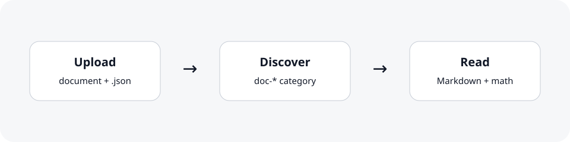

# OpenAI Deep Research — Example Document

This is a working example document. It exists so you can see the exact upload pattern and verify that Markdown, relative images, and math render correctly inside the portfolio reader.

When you are ready, you can delete this example and upload your own files to this directory.

## Example workflow

For a new Markdown note, upload both files:

```text
doc-openai-deep-research/my-note.md
doc-openai-deep-research/my-note.md.json
```

The sidecar file controls the date and tags shown in the document list.

## Relative image

The image below is referenced relative to this Markdown file:



## Math rendering

Inline math renders like this: $p(y\mid x, \theta)$.

Display math renders like this:

$$
\operatorname{score}(x) = \sum_{i=1}^{n} w_i f_i(x)
$$

## Markdown features

| Feature | Expected behavior |
| --- | --- |
| Headings | Render as document structure |
| Tables | Render as HTML tables |
| Images | Resolve relative to this `.md` file |
| Math | Render with KaTeX |
| Code | Preserve fenced code formatting |

```python
def example():
    return "Markdown source only"
```
